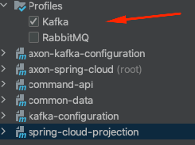

Axon Framework event listener tarafında aynı kod ile rabbitmq ve kafkayı destekleyebilmek için yapılan POC çalışmasıdır.

Maven profile değiştirilerek Kafka veya RabbitMQ ile kullanılabilir.\
\

#RUN
- [CloudProjectionApplication](spring-cloud-projection/src/main/java/com/example/demo/CloudProjectionApplication.java)
- [CommandApiApplication](command-api/src/main/java/com/example/demo/CommandApiApplication.java)

[Postgresql Docker YML](docker-yml/postgres/docker-compose.yml)\
[Kafka Docker YML](docker-yml/kafka/docker-compose.yml)\
[RabbitMQ Docker YML](docker-yml/rabbitmq/docker-compose.yml)

Rest API için Postman' e linkteki JSON dosyası import edilebilir.\
[Postman Collection JSON](Axon%20Spring%20Cloud%20Collection.postman_collection.json)